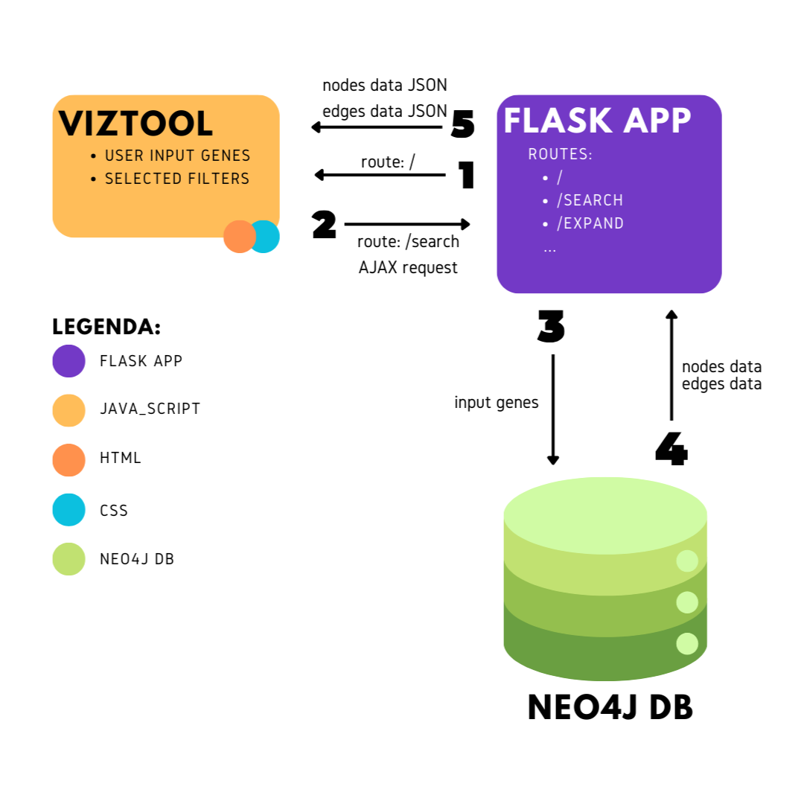

# Knowledge Network creation and Cork Oak Gene interactions Visualisation and Retrieval Tool (Canopy)

Welcome to the Cork Oak Gene Interactions Visualization Tool! Canopy is designed to retrieve and visualize gene regulatory networks in Quercus suber (cork oak), providing valuable insights into gene interactions. This project was developed as part of a thesis for the Master’s program in Bioinformatics and Computational Biology at the Faculdade de Ciências, Universidade de Lisboa.

## Running canopy

Canopy is intended to be integrated into CorkOakDB in the future. In the meantime, while the integration is not yet public, a Docker Compose setup is available for local deployment.
### First-Time Setup: Running Canopy for the First Time
Before starting the application, you need to load the initial data into the Neo4j database.

#### 1. Load **nodes** into Neo4j
Run this command to load the nodes from a CSV file (located in Neo4j's import-accessible directory):
```bash
python load_neo4j_db.py \
  --function load_nodes_to_neo4j \
  --data_dir /var/lib/neo4j/import/custom_folder \
  --nodes_file_name custom_nodes.csv 
```
#### 2. Load **edges** into Neo4j
Run this command to load the edges from a CSV file (located in Neo4j's import-accessible directory). This may take a few minutes...
```bash
python load_neo4j_db.py \
  --function load_edges_to_neo4j \
  --data_dir /var/lib/neo4j/import/custom_folder \
  --edges_file_name custom_edges.csv
```

From the directory containing the docker-compose.yml file, run:
```bash
docker compose up --build
```

### Subsequent Runs
Once the data is loaded, you can start the Canopy application with:
```bash
docker compose up
```

## Table of Contents
1. [Project Structure](#project-structure)
2. [CKN Contruction](#ckn-construction)
   - [Requirements CKN](#requirements-ckn)
   - [Usage Instructions CKN](#usage-instructions-ckn)
   - [Overview and Scripts CKN](#overview-and-scripts-ckn)
   - [Data Sources CKN](#data-sources-ckn)
3. [Canopy](#canopy)
   - [Overview](#overview)
   - [Features](#features)


## Project Structure

To continue go to https://tree.nathanfriend.com/?s=(%27options!(%27fancy2~fullPath!false~trailingSlash2~rootDot2)~4(%274%27bin.da5BioProjects_info*cis_elemet6fimo_out3gene6promoter6scaffold6TF_motif6-fas5connectTF3output*dap_seq*da5030_annotation30_index*proteome*scripts*seidr_output.viz_tool*static*templates*images*..%20%27)~version!%271%27)*.--%20%20.%5Cn0genome2!true3*-4source!5ta*6s3%01654320.-*


```
.
├── data/
│   ├── BioProjects_info
│   ├── cis_elemets/
│   │   ├── fimo_out
│   │   ├── genes
│   │   ├── promoters
│   │   ├── scaffolds
│   │   └── TF_motifs/
│   │       └── fasta
│   ├── connectTF/
│   │   └── output
│   ├── dap_seq
│   ├── data
│   ├── genome/
│   │   ├── genome_annotation
│   │   └── genome_index
│   ├── proteome
│   ├── scripts
│   └── seidr_output
└── viz_tool/
    ├── static/
    │   └── images
    ├── templates
    └── data
```
Important to notice that some Directories will be created along side the running of some scripts as for exemple the BioProjects directories...

### Directory Builder
- `create_directories.sh`: Builds the necessary directories for the project

# CKN Construction
## Requirements CKN
All the tools and versions used are available in a Requirements.txt file. Here is a simple representation.

- **Screen** - (for background activities; Optional but very usefull)
- **Entrez Direct (EDirect)** – NCBI command-line utilities
- **SRA Toolkit** - (for prefetch and fasterq-dump)
- **FastQC**
- **Trimmomatic**
- **STAR** - (for RNA-seq alignment)
- **Subread** - (for RNA-seq alignment)
- **BamTools** - (for BAM file manipulation)
- **Python**
  - pandas
  - argparse - (for argument parsing)
- **R & Rstudio**
  - argparse - (for argument parsing)
  - ggplot2 - (for creating visualizations)
  - RColorBrewer - (for generating color palettes)
  - pheatmap - (for creating heatmaps)
  - DESeq2 - (for performing differential expression analysis)
  - MASS - (for efficient writing of large matrices)
- **Seidr** - (for co-expression network prediction)
- **BEDTools** - (for processing genomic data)
- **FIMO (MEME Suite)** - (for motif matching)

## Usage Instructions CKN
### 1. Selecting BioProjects

`./fetch_ncbi_BioP.sh` or `./fetch_ncbi_BioP.sh 'Custom NCBI Query'` - Gather information on the BioProjects to extract RNASeq data

### 2. Extracting Processing and raw counts
`./BioProject [reads format]` - To extract the data for a specific Bioproject and process until Raw counts is obatined

`./Raw_Counts_Processing.R` and `Raw_Counts_normalization.R` - Preparing data for Seidr

### 3. Seidr
`./seidr.sh` - Run Seidr

### 4. ConnecTF Analysis

For ConnecTF section use the Utils functions in `connecTF.py`

 ### 5. Cis Elements Analysis
For Cis elements analysis:

`./get_tf_motif_matrix.sh`

`./get_all_promoters_sequeces.sh`

`./get_promoter_sequece.sh`

`./fimo.py`

 ### 6. Dap Seq
 `./dap_seq.py`

 ### 7. Generating nodes and edges Tables
 `./generate_edges_nodes_tables.py`

## Overview and Scripts CKN 
In this section, I developed and enhanced an automated pipeline to construct a comprehensive knowledge network (CKN) for Quercus suber (cork oak), with a particular focus on gene interactions related to secondary growth. The pipeline is designed to streamline the generation and refinement of the CKN, providing efficient and accurate insights into the gene interactions that play a key role in cork oak's secondary growth. This section can be divided into 5 major steps:

### 1. Aggregation and preprocessing of RNA-seq expression data

- **`fetch_ncbi_BioP.sh`**: Retrieves information about the Bioprojects gathered by the query.
- **`prefetch.sh`**: Retrieves RNA-seq data files from the Sequence Read Archive (SRA).
- **`fasterq_dump.sh`**: Converts SRA files into FASTQ format for downstream processing.
- **`preprocessing.sh`**: Executes trimming and quality control of reads using Trimmomatic and FastQC.
- **`log_trim_reads.sh`**: Logs the results of trimming operations to track preprocessing quality.
- **`star_fc.sh`**: Aligns RNA-seq reads using STAR and generates raw read counts using featureCounts.
- **`log_star.sh`**: Logs alignment statistics produced by the STAR aligner.
- **`log_fc.sh`**: Logs read count results and featureCounts statistics.
- **`log_BioP_stats.sh`**: Collects and summarizes statistics for each BioProject.
- **`clean_BioP.sh`**: Removes intermediate files and directories to free up storage space.
- **`Raw_Counts_Processing.R`**: Merges raw count tables from different samples into a single table.
- **`Raw_Counts_normalization.R`**: Normalizes the merged raw counts for downstream analysis and generates a distance matrix regarding the data retrieved.
- **`extract_gene_annotation.sh`**: Generates a file with the products influenced by the Gene (extracted from the GTF file).

### 2. Prediction and analysis of the gene co-expression network

- **`seidr.sh`**: Prediction of the co-expression network.
- **`network_scores.py`**: Isolates the correlation scores of the network and imports them into Cytoscape.
- **`network_cut.py`**: Applies a minimum threshold for the edge scores in the network.
- **`network_scores_plots.py`**: Generates several plots allowing you to see the final correlation scores of the network.
- - **`extract_TF_TR_from_global_network.py`**: Trims a global Network to fetch TF-TF, TF-TR, TR-TF and TR-TR interactions to later be added in the targeted data. This is needed because seidr has a bug where whene running in seidr in targeted mode these interactions between 'targeted genes' are not kept.


### 3. ConnecTF software to find putative TF-Target interactions in my co-expression Network
ConnecTF is a database designed to predict and analyze transcription factor (TF)-target gene interactions by integrating various regulatory datasets. It identifies putative regulatory relationships using TF-binding evidence from sources such as DAP-seq, ChIP-seq, and motif enrichment analysis. ConnecTF enables researchers to filter and prioritize TF-target interactions based on experimental support, co-expression, and functional annotations, facilitating the study of gene regulatory networks in plants such as Arabidopsis, Maize and Rice.

- **`connecTF.py`**: Utility script with the necessary functions to get the inputs into ConnecTF:
  - **Target Network**: Generates a network with the arabidópsis homologues and with columns: `source`, `interaction`, `target`, and an optional `score` column.
  - **Target Gene List**: Defines a list of target genes to narrow down the output size.
  - **Filter Gene List**: Filters the network based on a given list of genes to refine the results.
  
  After generating the predictions, the script transforms the Arabidopsis homologs in the ConnecTF network to their corresponding genes in *Quercus suber* using a Blast_p file between arabidópsis and Quercus Suber.

### 4. Cis-elements analysis to find TF motifs in the genes of the network

- **`get_tf_motif_matrix.sh`**: Downloads transcription factor (TF) motif files from PlantTFDB, maps Arabidopsis TFs to corresponding Quercus suber genes using a provided match file.
- **`get_all_promoters_sequeces.sh`**: Extracts gene coordinates from a Cork Oak genome annotation file (gff), determines scaffold sizes, and retrieves promoter regions (default: 2kb upstream). It then generates BED files with promoter sequences using BEDTools and outputs them in FASTA format for further analysis.
- **`get_promoter_sequece.sh`**: Processes Cork Oak promoter sequences by extracting scaffold names, sequences, and associated gene annotations. It merges promoter sequences from a BED file with gene information from a coordinate file, formatting the data into a structured CSV file for further analysis.
- **`TFBS_promoter_matcher.py`**: Filters a co-expression network to find target genes regulated by a given transcription factor (TF) and extracts their corresponding promoter sequences, saving them in FASTA format. (It's runned in `fimo.py`)
- **`fimo.py`**: Validates transcription factor (TF) targets by checking for transcription factor binding sites (TFBS) in their promoter regions. It processes a co-expression network, extracts target gene promoter sequences, and uses FIMO (from the MEME Suite) to identify motif matches. The results are compiled into an output table indicating whether a TF-target interaction is validated based on motif presence.

### 5. Dap-Seq data Introduction
- **`dap_seq.sh`**: Reads multiple text files containing target genes for each gene, creates a dataframe with gene_id and TARGET columns representing gene-target interactions, and saves it as a tab-separated file (dap_seq.txt). Only have DapSeq data for three genes: LOC111997151; LOC112008346; LOC112030452

### 6. Nodes & Edges data tables
- **`generate_edges_nodes_tables.py`**: Extracts information from all the above methods to create 2 final tables(nodes and edges) with all the necessary information from where the database will extract the data to load later.

## Data Sources CKN
This project utilizes previously available data from other studies and analyses. Rather than generating new datasets, I have integrated existing resources that were either publicly accessible or derived from prior work conducted for future analyses. The two main appropriated data sets were TF TR Data and blast data


# Canopy
## Tool Overview
This tool follows a client-server architecture, where the backend handles data processing and retrieval, while the frontend provides an interactive user interface. The backend consists of a Flask application that communicates with a Neo4j database to manage and query gene interaction data. Additionally, Redis is used for caching and optimizing data retrieval.

The Flask backend exposes a RESTful API, which the frontend interacts with using AJAX. These API endpoints allow the frontend to send requests and retrieve data dynamically, enabling real-time updates without requiring full page reloads.

On the frontend, the tool is built with HTML, CSS, and JavaScript, leveraging AJAX to communicate with the API. This approach ensures a smooth user experience by fetching and displaying gene interaction data based on user input.

### Flask application
The Flask backend serves as the core of the tool, managing data retrieval, processing, and interaction with the frontend. It integrates several components to efficiently handle requests and serve responses.

One of its key functionalities is Neo4j integration, which allows the backend to query the Neo4j database and retrieve gene interaction data for analysis. To enhance performance, the backend also utilizes Redis caching, storing and retrieving processed graph data efficiently. Additionally, it exposes AJAX API endpoints, enabling the frontend to send asynchronous requests and receive responses without reloading the page. This structure ensures smooth and responsive interactions for users exploring gene relationships. 

 #### Main Routes
 - `/` - Renders the main webpage
 - `/search` - Processes user queries, retrieves gene interactions, filters results, and stores the subgraph in Redis.
 - `/expand` - Expands a node in the network by retrieving additional interactions and updates the graph.
 - `/report` - Generates a PDF report with queried genes, edges, filters and a network image.
-  `/about` & `user_guide` - Render static pages for additional information.

### Neo4J Database
Neo4j is a graph database designed to store and manage highly connected data. Unlike traditional relational databases, which use tables and rows, Neo4j represents data as nodes (entities) and edges (relationships), making it ideal for storing gene interactions. It uses the Cypher query language to efficiently retrieve and analyze relationships, enabling fast and flexible data exploration.

Although my dataset contains both directed and undirected edges, Neo4j only supports directed relationships. As a result, even if an edge is undirected in the edges table, Neo4j assigns it a random direction (either source → target or target → source). However, this does not pose an issue since queries are performed without considering direction, and the data is processed accordingly to achieve the intended goal.

### NetworkX
To process the data more easily, I convert the extracted database data into a NetworkX object, which can be either a directed or undirected graph. I use a MultiDiGraph, which allows multiple directed edges between the same pair of nodes. This choice enables me to represent both undirected and directed relationships between the same two nodes within the same structure.

#### The following schema presents a simplified representation of the process, from loading the main webpage to generating the visualization.


## Features
This Gene Interaction Vizualisation Tool offers some important Features like:

### **Search & Retrievel** 
When the user submits a query with the Cork Oak genes of interest, the system checks if these genes exist in the database. If at least one gene is found, the process continues in the backend, where the relevant network data is retrieved and processed. If none are found, the user receives an alert. The search bar includes trimming functionality to remove leading and trailing spaces, ensuring accurate and efficient searches. Additionally, it supports case-insensitive matching to enhance user experience and prevent mismatches due to formatting inconsistencies.

### **Filters**
 There are two separate but complementary set of filter.
 - **IRP Score Range Slider**: This filter allows the user to select the minimum IRP (co-expression value used by Seidr) score for
the edges displayed in the graph

 - **Rank Filter**: This filter allows the user to choose the type / process used to obtain a edge. There are 2 major Rank options:
   
   - Co-Expression: Co-expression related edges extracted from seidr software are shown.
   - Regulatory edges: All direct edges predicted by either ConnecTF, Cis-Elements or Dap-Seq analysis are shown. 
     - ConnecTF: Direct edges found by ConnecTF are shown (to represent candidate TF-target relations based on data from model plants)
     - Cis-Elements: Direct edges found by the presence of cis-elements in the target promoter (to represent candidate TF-target relations based on the presence of cis-elements for a given TF in the promoter region of genes).
     - Dap-Seq: Connections identified by DapSeq technique. Only available for LOC111997151, LOC112008346, and LOC112030452.

### **Interactive Graph**
For network visualization, the vis-network library (https://github.com/visjs/vis-network) will
be used because of its user-friendly interface, extensive customization options, and support for clustering,
which aids in managing larger networks. The width of the edges will vary based on the IRP score for
co-expressed edges and the method, and number of methods, to achieve the direction for directed edges. There is also the option to
ask for an information table for each node and edge.

### **Export Options**
You can export the network and related data for offline analysis or reporting. Here are the available export options:

 - Nodes Table
Download a CSV file that represents the table of all nodes in the network, including gene identifiers and related information.

 - Edges Table
Download a CSV file that represents the table of all edges in the network, including interaction scores and other attributes.

 - Network PNG
Download a visual representation of the entire network as a PNG image for use in reports or presentations.

 - PDF Report
Download a detailed PDF report containing the network summary, nodes, edges, image, and other relevant information for further analysis or documentation.

## Data Sources VizTool
The visualization tool was inspired by the Stress Knowledge Map project [DOI: 10.1016/j.xplc.2024.100920] available at https://skm.nib.si/ckn/?identifier=AT1G64280&identifier=AT3G22400&identifier=AT3G14440, and by publicly available work hosted at https://github.com/vpodpecan/ckn_viz. These resources provided valuable design and structural insights for the development of the cork oak gene interaction visualization platform.

